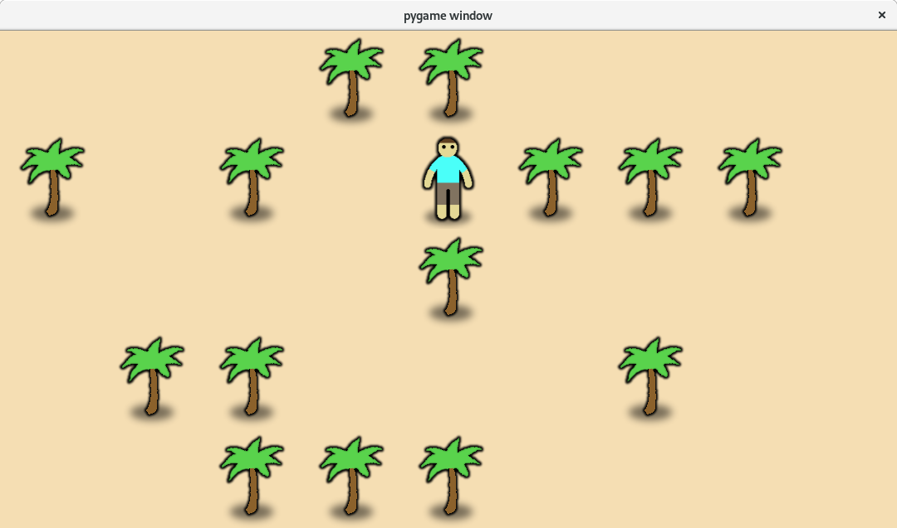

# algo

Python implementation of basic algorithms:

- Quicksort
- Breath search
- Dijkstra
- A*

Run A* demo UI with command below (args: x size, y size, tree count). Use left clik to move the unit and right click to add or remove trees.

```bash
python ui.py 9 5 14
```


